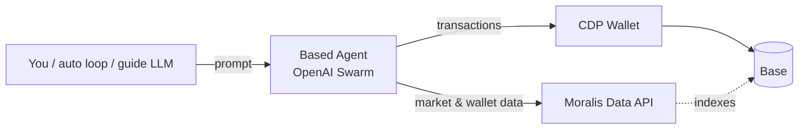

# 🔵 Based Agent × Moralis

An autonomous AI agent that researches and trades tokens on [Base](https://base.org). It combines three pieces:

- **[OpenAI Swarm](https://github.com/openai/swarm)** for the agent loop and tool calling
- **[Coinbase Developer Platform (CDP) SDK](https://docs.cdp.coinbase.com/)** for the wallet and onchain actions (swaps, token and NFT deploys, Basenames)
- **[Moralis Web3 Data API](https://docs.moralis.com/web3-data-api/evm)** for market intelligence: trending tokens, security scores, token analytics, DEX pairs, wallet balances, PnL, and NFTs

This is a fork of Coinbase's [Based Agent](https://github.com/murrlincoln/Based-Agent) template. It swaps the "do something creative onchain" persona for a data-driven investment agent backed by Moralis.

> [!WARNING]
> **This agent can move real money.** On `base-mainnet` it can swap your wallet's assets on its own. Autonomous mode takes an action every few seconds without asking. Start on `base-sepolia`, fund the wallet only with what you can afford to lose, and treat the project as an experiment, not financial advice.

---

## How it works



Its default instructions tell the agent to:

1. Find trending Base tokens that pass a minimum security score and market cap.
2. Check each candidate's details and liquidity.
3. Look at the wallet's balances to decide how much to invest safely.
4. Swap into the tokens that look promising.

## Tools

| Tool | Source | What it does |
| --- | --- | --- |
| `get_trending_tokens(security_score, min_market_cap, limit)` | Moralis | Lists trending Base tokens, filtered by security score and market cap |
| `get_token_details(token_address)` | Moralis | Returns price, market cap, security score, age, holder and volume trends |
| `get_token_metadata(token_address)` | Moralis | Returns name, symbol, decimals, supply, and verification status |
| `get_token_pairs(token_address)` | Moralis | Lists DEX pairs with price, 24h change, and liquidity |
| `get_wallet_tokens()` | Moralis | Lists the agent wallet's token balances with USD prices |
| `get_wallet_pnl()` | Moralis | Shows realized profit and cost basis per token traded |
| `get_wallet_nfts()` | Moralis | Lists NFTs held by the agent wallet |
| `swap_assets(amount, from_asset_id, to_asset_id)` | CDP | Swaps one asset for another (mainnet only) |
| `create_token(name, symbol, initial_supply)` | CDP | Deploys an ERC-20 token |
| `deploy_nft(name, symbol, base_uri)` | CDP | Deploys an ERC-721 collection |
| `mint_nft(contract_address, mint_to)` | CDP | Mints an NFT |
| `register_basename(basename, amount)` | CDP | Registers a `.base.eth` / `.basetest.eth` name for the wallet |
| `request_eth_from_faucet()` | CDP | Requests testnet ETH (Base Sepolia only) |
| `generate_art(prompt)` | OpenAI | Generates an image with DALL-E. *Opt-in:* set `ENABLE_ART_GENERATION=true` |
| `post_to_twitter`, `check_twitter_mentions`, `reply_to_twitter_mention`, `search_twitter` | X API v2 | *Opt-in:* set all four `TWITTER_*` variables |

Tool data follows the wallet's network (Base or Base Sepolia). The exceptions are `get_trending_tokens` and `get_wallet_pnl`, which always read Base mainnet.

## Quick start

### 1. Prerequisites

- Python 3.10+
- A [CDP API key](https://portal.cdp.coinbase.com/)
- An [OpenAI API key](https://platform.openai.com/api-keys) on a paid account
- A [Moralis API key](https://admin.moralis.com/) (the free tier works)

### 2. Install

```bash
git clone https://github.com/bharathbabu3017/Based-Agent-Moralis.git
cd Based-Agent-Moralis

# with Poetry
poetry install

# or with pip
python -m venv .venv && source .venv/bin/activate
pip install -r requirements.txt
```

### 3. Configure

```bash
cp .env.example .env
```

Fill in `CDP_API_KEY_NAME`, `CDP_PRIVATE_KEY`, `OPENAI_API_KEY`, and `MORALIS_API_KEY`. The app loads `.env` automatically. Plain environment variables work too, including Replit Secrets.

| Variable | Default | Description |
| --- | --- | --- |
| `NETWORK_ID` | `base-sepolia` | Network for a **newly created** wallet (`base-sepolia` or `base-mainnet`) |
| `CDP_WALLET_ID` | — | Wallet to reuse (see below) |
| `WALLET_SEED_FILE` | `wallet_seed.json` | Where the encrypted wallet seed is stored |
| `OPENAI_MODEL` | `gpt-4o` | Model that powers the Based Agent |
| `OPENAI_GUIDE_MODEL` | `gpt-4o-mini` | Model that plays the user in two-agent mode |
| `ENABLE_ART_GENERATION` | `false` | Adds the `generate_art` tool |
| `TWITTER_API_KEY`, `TWITTER_API_SECRET`, `TWITTER_ACCESS_TOKEN`, `TWITTER_ACCESS_TOKEN_SECRET` | — | Adds the X/Twitter tools |

### 4. Run

```bash
python run.py                            # choose a mode interactively
python run.py --mode chat                # talk to the agent
python run.py --mode auto --interval 60  # act autonomously every 60 seconds
python run.py --mode two-agent           # a second LLM guides the agent
```

(With Poetry, prefix the commands with `poetry run`.)

| Mode | Description |
| --- | --- |
| `chat` | Interactive REPL. You ask, the agent researches and acts. |
| `auto` | Sends the agent a prompt to act every `--interval` seconds until you press Ctrl+C. |
| `two-agent` | An OpenAI "guide" model suggests tasks and responds to the agent's output. Press Enter after each turn to continue. |

## Wallet persistence

At startup the agent picks its wallet in this order:

1. **`CDP_WALLET_ID` is set:** it fetches that wallet and loads its seed from `WALLET_SEED_FILE`.
2. **`WALLET_SEED_FILE` holds exactly one wallet:** it loads that wallet.
3. **Neither:** it creates a new wallet on `NETWORK_ID` and saves the seed to `WALLET_SEED_FILE`, encrypted with your CDP key.

The wallet address and network print at startup. On testnet, fund the wallet by asking the agent to "request ETH from the faucet". On mainnet, send ETH to the printed address.

> [!IMPORTANT]
> `wallet_seed.json` controls the wallet's funds. It is in `.gitignore`, so keep it out of version control, and back it up somewhere safe. File-based seed storage is for development only. See CDP's [wallet management docs](https://docs.cdp.coinbase.com/mpc-wallet/docs/wallets) for production options.

## Project structure

```
.
├── run.py                   # CLI entry point: chat / auto / two-agent modes
├── based_agent/
│   ├── agent.py             # Agent instructions and tool registry
│   ├── config.py            # Environment variable handling
│   ├── wallet.py            # Lazy CDP wallet load / create / persist
│   ├── abis.py              # Basenames contract addresses and ABIs
│   └── tools/
│       ├── common.py        # @tool decorator (turns exceptions into messages for the LLM)
│       ├── moralis.py       # Moralis market and wallet data tools
│       ├── onchain.py       # CDP onchain action tools
│       └── twitter.py       # Optional X/Twitter tools
└── tests/
    ├── test_tools.py        # Offline unit tests
    └── test_evals.py        # LLM tool-selection evals (need OPENAI_API_KEY)
```

## Adding a tool

1. Write a function in `based_agent/tools/` that returns a string. Swarm builds the tool schema from the **type hints** and **docstring**, so write both carefully.
2. Decorate it with `@tool("doing something")` so that errors go back to the model instead of crashing the loop.
3. Register it in `build_functions()` in `based_agent/agent.py`.

```python
from based_agent.tools.common import tool
from based_agent.tools.moralis import moralis_get, wallet_chain


@tool("fetching token holders")
def get_token_holders(token_address: str) -> str:
    """
    Get holder distribution stats for an ERC-20 token.

    Args:
        token_address (str): The address of the ERC-20 token
    """
    stats = moralis_get(f"/erc20/{token_address}/holders", {"chain": wallet_chain()})
    return f"Total holders: {stats.get('totalHolders')}"
```

## Testing

```bash
pytest               # offline unit tests (no keys or network needed)
pytest -m evals      # checks the model picks the right tool (calls OpenAI, costs a little)
```

## Running on Replit

Import the repo into Replit and add the environment variables under **Secrets**. Then press **Run**:


The included `.replit` deployment runs the agent in `auto` mode with a 60-second interval.

## Security notes

- Never commit `.env`, `wallet_seed.json`, or CDP key files. All three are gitignored.
- Tool output (token names, tweets) comes from third parties and could contain prompt-injection attempts. Be especially careful when you combine the Twitter tools with mainnet swaps.
- The agent has no hard spending limit. Its instructions ask it to size trades conservatively, but you should enforce limits yourself before trusting it with meaningful funds. For example, add a cap check inside `swap_assets`.

## Acknowledgements

- [Based Agent](https://github.com/murrlincoln/Based-Agent) by Lincoln Murr (Coinbase) and Kevin Leffew (Replit), the original template
- [Coinbase Developer Platform](https://docs.cdp.coinbase.com/)
- [OpenAI Swarm](https://github.com/openai/swarm)
- [Moralis](https://moralis.com/)

## License

[MIT](LICENSE)
